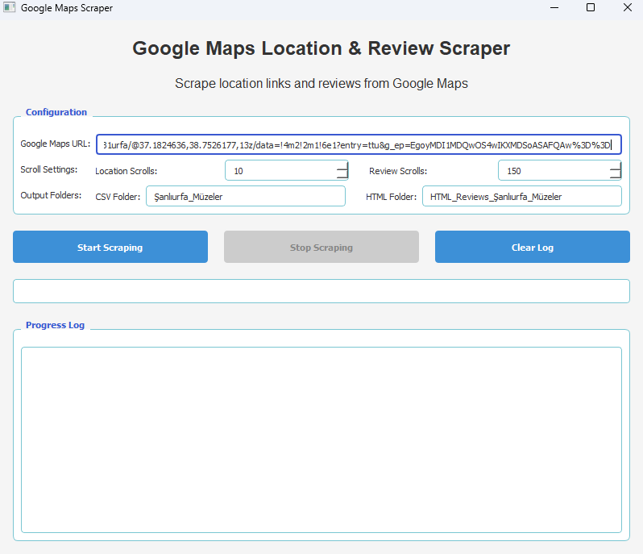

# Google Maps Scraper



## Overview
A powerful tool for scraping location data and reviews from Google Maps. This application provides an intuitive GUI to configure and run the scraping process, with real-time progress tracking and the ability to stop the process at any time.

## Features
- **Location Scraping**: Automatically extracts location links from Google Maps search results
- **Review Scraping**: Collects detailed review data from each location
- **Customizable Parameters**: Configure scroll depth for both locations and reviews
- **Multi-format Output**: Saves data in both CSV and HTML formats
- **User-friendly Interface**: Modern GUI with progress tracking and status updates
- **Stop Anytime**: Cancel the scraping process with a single click

## Requirements
- Python 3.6+
- Chrome browser
- ChromeDriver (included)
- Required Python packages (see requirements.txt)

## Installation
1. Clone this repository or download the ZIP file
2. Install required packages:
```
pip install -r requirements.txt
```

## Usage
1. Run the application:
```
python maps_scraper_app.py
```
2. Enter the Google Maps URL you want to scrape
3. Configure scraping parameters:
   - Number of scrolls for location discovery
   - Number of scrolls for review collection
   - Output folder names
4. Click "Start Scraping" and monitor progress
5. Results will be saved in the specified folders

## Output Files
- **CSV Files**: Structured data for easy analysis
- **HTML Files**: Formatted review pages with original styling and embedded images

## License
See the LICENSE file for details.

## Disclaimer
This tool is for educational purposes only. Always respect Google's Terms of Service and robots.txt policies when scraping data.